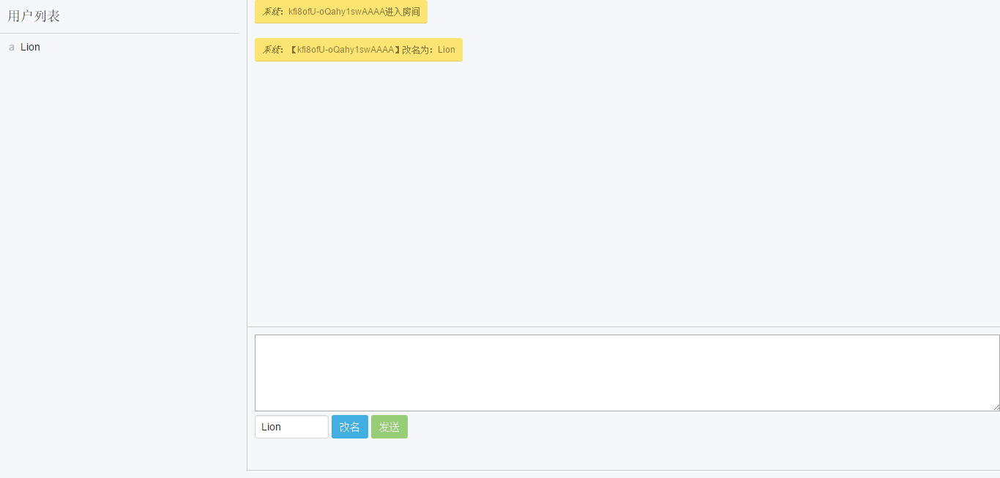
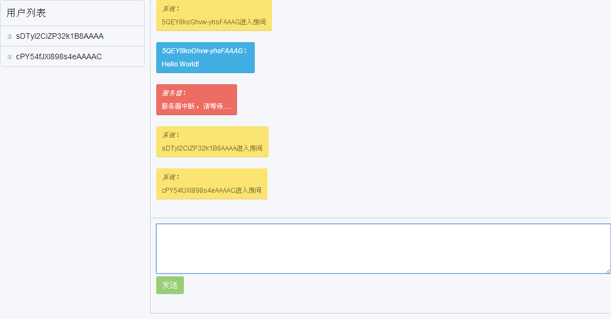

# chatroom

> 使用node.js与socket.io开发的聊天室

### 说明

开发时，node.js版本是4.0.0。其它的版本在信息都在package.json中。

**安装**

+ 安装node.js
+ npm install
+ node app.js

默认使用的是3000端口，打开网页，即可进入聊天室。此聊天室为公共聊天室。

也可以创建个人聊天室，只要在地址后增加路径即可，例如：127.0.0.1:3000/mychat。mychat即为聊天室名称。

> ps:最好起一个别人猜不到或者不容易被使用的聊天室名称。

增加了演示地址：[http://104.251.225.48:3000](http://104.251.225.48:3000)，感兴趣的可以先体验一下。

> ps:由于服务器在国外，会有无法访问、不稳定或者断线的情况发生，还希望谅解。

### 版本发布日志

*2016-03-31 v1.0.3*

+ 临时增加违规名字判断
+ 修复发送空消息问题
+ 修复发送js代码时，显示空消息问题
+ 修改页面布局，高度不再100%，增加最大高度，缩小用户列表宽度

*2016-03-25 v1.0.2*

+ 增加当前用户发送的消息与其他人发送的消息背景色区分
+ 修复重名问题
+ 修复空名字问题
+ 修复退出聊天室时，提示信息中显示用户ID不显示用户名的问题

*2016-03-24 v1.0.1*

+ 增加改名功能
+ 修复FF下回车无法发送消息的问题
+ 用户列表样式修改，去除多余线条

*2016-03-18 v1.0.0*

发布项目的测试第一版本，仅实现聊天室基础功能

